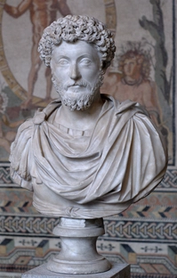

Sveiki atvykę į kasdienę apmąstymų ir asmeninio augimo erdvę.

<article>
  <h2>🕊️ Tik Šiandien – Stoikų apmąstymas</h2>

  

    
    <blockquote style="flex: 1;">
      „Laimė priklauso nuo tavęs. Ne nuo to, kas vyksta išorėje, bet nuo to,
      kaip tu tai vertini.“
       — Markas Aurelijus
    </blockquote>
  

**Tik šiandien...**

Tik šiandien stengsiuosi gyventi šią dieną – nebandydamas išspręsti viso
savo gyvenimo vienu metu. Priimsiu tai, ką man duoda ši diena, ir
nebijosiu ateities.

Tik šiandien susitelksiu į tai, ką galiu kontroliuoti – savo mintis,
žodžius ir veiksmus. Nešvaistysiu energijos dalykams, kurių negaliu
pakeisti.

Tik šiandien praktikuosiu dėkingumą. Pastebėsiu mažus džiaugsmus.
Neieškosiu kaltės kituose, bet pažvelgsiu į save su atjauta ir
sąžiningumu.

Tik šiandien kalbėsiu mažiau, bet prasmingai. Klausysiu, kai kiti kalba.
Stengsiuosi suprasti, o ne būti suprastas.

Tik šiandien nepasiduosiu impulsams. Veiksiu pagal dorybę, kantrybę ir
ramybę. Ne viskas turi būti išspręsta šiandien.

Ir jei man pasiseks gyventi taip šiandien – tai bus pakankamai.

_To pakanka._

</article>
